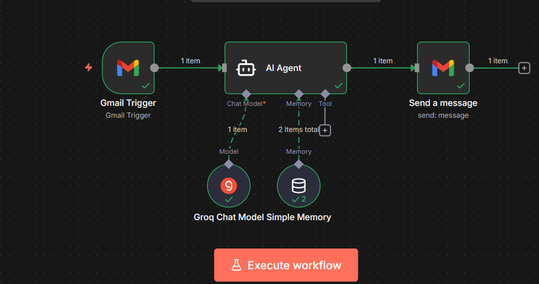
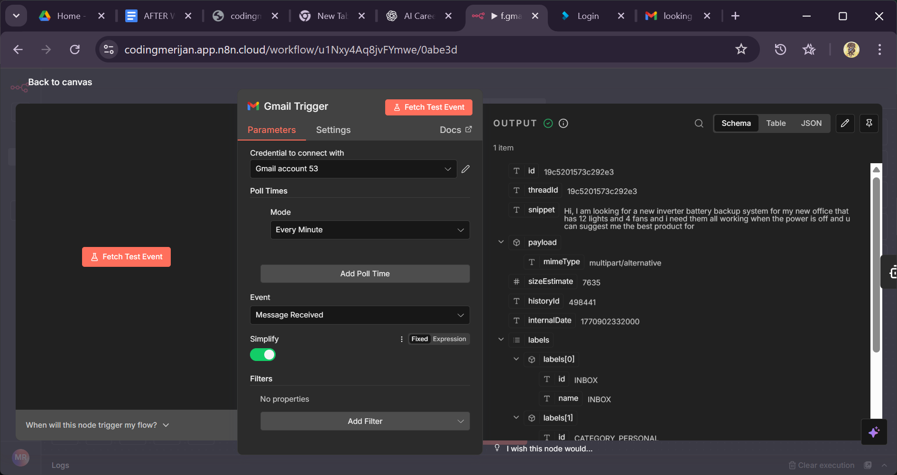
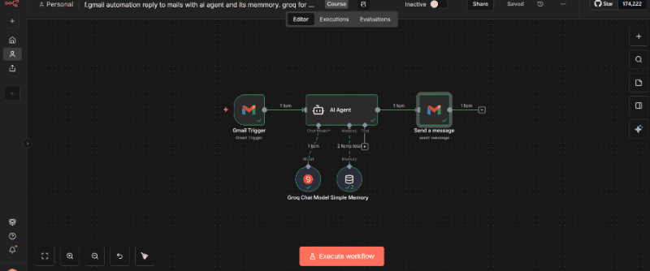

# AI Gmail Auto-Reply Agent

## Overview

This project implements an LLM-powered Gmail auto-reply system using Groq API with contextual memory support.

The system automatically reads incoming emails, generates intelligent contextual replies using an LLM model, and sends responses based on structured prompt logic.

Designed for business email automation and intelligent response handling.

---

## Problem Statement

Manual email handling consumes significant operational time for businesses. Repetitive queries, follow-ups, and standard support messages reduce productivity.

This system automates intelligent email response generation while preserving context and communication quality.

---

## Architecture

1. Gmail Trigger (Incoming Email)
2. Context Extraction
3. Memory Handling
4. LLM Processing (Groq API)
5. Structured Reply Generation
6. Automated Gmail Response

---

## Technologies Used

- n8n (Workflow Automation)
- Groq LLM API
- Gmail API
- REST API Integration
- Prompt Engineering
- Contextual Memory Handling

---

## Key Features

- Context-aware reply generation
- Structured system prompt control
- Automated response pipeline
- Business communication optimization
- Scalable automation architecture

---

## Future Improvements

- Add retry & error logging
- Add rate-limit handling
- Deploy cloud-based workflow
- Add monitoring dashboard

---

## Author

**Mohanarengan Krishnaraja**  
Generative AI & Automation Developer

## Workflow Screenshots

### 1. Workflow Architecture

This workflow is designed as a fully automated AI-driven Gmail response system.

Flow:
Gmail Trigger → AI Agent → Groq LLM → Memory → Gmail Send Node

The system continuously monitors incoming emails and processes them through an LLM-powered response engine.

---

### 2. Execution Logs

Execution logs confirm:

- Trigger activation
- Token usage
- Response generation timing
- Node execution success

This helps monitor performance, cost efficiency, and debugging.

---

### 3. Gmail Trigger Configuration

The Gmail trigger is scheduled to poll every 1 minute.

This interval can be adjusted depending on:
- Business urgency
- API usage limits
- Operational cost considerations

---

### 4. AI Agent Settings

The AI Agent node maps:

- Subject → context
- Email body → main input

A structured System Message defines:
- Business identity
- Communication tone
- Allowed recommendations
- Brand constraints

---

### 5. Groq LLM Configuration

Model Used: llama-3.1-8b-instant

Groq provides fast inference with low latency, suitable for real-time email automation.

---

### 6. Session-Based Memory

Memory is configured using:

Session Key: {{ $json.From }}

This ensures each customer conversation maintains context across replies.

---

### 7. Gmail Send Configuration

The final node sends:

To: Original sender
Subject: RE: Original subject
Body: LLM generated response

This closes the automation loop.

## Limitations & Improvement Areas

- Poll-based trigger may cause slight response delay.
- No email classification layer (e.g., spam vs business inquiry).
- No structured product database integration yet.
- No confidence scoring for LLM responses.
- Risk of hallucinated specifications if prompt not strictly constrained.

Future Improvements:
- Add RAG with product catalog
- Add lead scoring layer
- Add human approval workflow
- Add analytics dashboard
- Add to append in sheets database also message to management and operation teams on discussed mail

  ---

## System Architecture

This project follows an event-driven AI automation architecture.

Trigger Layer:
- Gmail Trigger (Polling-based event detection)

Processing Layer:
- AI Agent (Prompt orchestration + contextual reasoning)
- Groq LLM (Inference engine)

State Management:
- Session-based memory keyed by sender email

Response Layer:
- Gmail Send Node (Automated contextual reply)

This layered structure ensures modularity and scalability.

---

## Design Decisions

### 1. Polling-Based Trigger
The Gmail trigger is configured to check new emails every 1 minute.

Reason:
- Simple deployment model
- No webhook exposure required
- Suitable for SMB-scale automation

Tradeoff:
- Slight delay compared to push-based webhook systems

---

### 2. LLM Selection – Groq (llama-3.1-8b-instant)
Chosen for:
- Low-latency inference
- Cost efficiency
- Reliable structured text generation

---

### 3. Session-Based Memory Strategy
Memory key: Sender email

Purpose:
- Maintain conversation continuity
- Avoid repeated clarification
- Enable multi-step email discussions

Limitation:
- No persistent database storage
- Memory resets if workflow restarts

---

## Prompt Engineering Strategy

The AI Agent is governed by a structured system message defining:

- Business identity and expertise
- Communication tone and politeness rules
- Product and service boundaries
- Escalation scenarios
- Response formatting expectations

Key Objectives:

1. Avoid hallucinated technical specifications
2. Ask clarifying questions when requirements are incomplete
3. Maintain professional yet empathetic tone
4. Restrict recommendations to supported products/services

Prompt constraints are periodically refined based on real email interactions to improve response accuracy and tone alignment.

  ---

## Production Risks & Limitations

Current Constraints:

- Polling-based trigger may introduce slight response delay.
- No spam or intent classification before LLM processing.
- No structured product catalog retrieval (RAG not yet integrated).
- No rate-limit protection mechanism for high email volumes.
- No human-in-the-loop validation for sensitive responses.
- Session memory not persisted in external database.

Operational Risks:

- Potential LLM hallucination if prompt constraints are weakened.
- Context window limitations for long conversation threads.
- API dependency risk (Groq availability and quota limits).

---

## Enterprise-Ready Improvements

To evolve this system into production-grade enterprise deployment:

### 1. RAG Integration
- Connect vector database containing product catalog.
- Retrieve structured specifications before LLM response.
- Reduce hallucination risk.

### 2. Email Classification Layer
- Add intent detection (support / sales / complaint / spam).
- Route to specialized agents.

### 3. Human-in-the-Loop Mode
- Add approval step for high-value or sensitive emails.
- Maintain audit logs.

### 4. Persistent Memory
- Store conversation history in external database (PostgreSQL / Redis).
- Enable long-term contextual continuity.

### 5. Monitoring & Analytics
- Track response latency.
- Monitor token usage.
- Log cost per response.
- Detect abnormal behavior patterns.

### 6. Rate Limiting & Failover
- Add retry logic.
- Implement API quota monitoring.
- Add fallback model support.

- ## Live Workflow Demo

